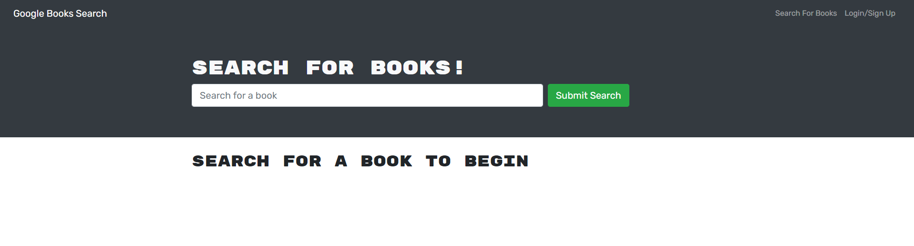
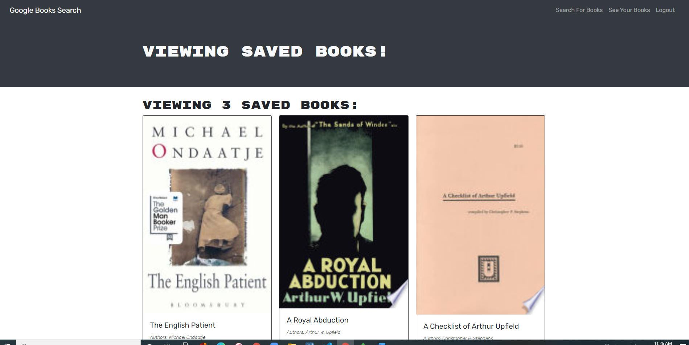

# Book Search

[](https://opensource.org/licenses/MIT)

## Description

This is an applicaion which allows a user to search for books and to save books to their User profile.  To save a book users must have setup a User account, which for new users they do by clicking on the Signup Tab, otherwise for returning users they complete the login form.

Once users are logged in they can save books to their user profile.  They can see books they have already save by clicking on the 'See Your Books' option in the header

Users can also delete books from their user profile from the 'See Your Books' option..


## 📖Table of Contents
1. [Installation](#installation)
2. [Usage](#usage)
3. [Assets](#assets)
4. [Technologies](#technologies)
5. [License](#license)
6. [Contributing](#contributing)
7. [Tests](#tests)
8. [Questions](#questions)

## Installation
1. To install this application clone it through GitHub using the following code in the terminal: 
    ``` 
    git clone https://github.com/Susanne85/book-search
    ```
2. To add the dependencies to the application, navigate to the root directory for the application and run:
    ```js
    npm install
    npm install express
    npm install apollo-server-express graphql
    npm install bcrypt
    ```
    
## Usage
Once the host, port, user, password and database details have been provided to the connection and the database has been created, navigate to the root directory for the application and run the following code in the terminal to start the application:

```js
npm start
```

## Assets

Live demo of the application hosted on Heroku: [Book Search](https://susannes-portfolio.herokuapp.com/)

The following images shows the functionality of the application: 
 




## Technologies
- [Node.js](https://nodejs.org/en/docs/)
- [Express](https://expressjs.com/)
- [Apollo](https://www.apollographql.com/docs/)
- [bcrypt](https://www.npmjs.com/package/bcrypt)
- JavaScript

## License

This project is [MIT](./LICENSE) licensed

## Contributing
Contributions, issues and feature requests are welcome.

Feel free to check the [issues page](https://github.com/Susanne85/book-search) if you want to contribute.

## Tests
There are no tests currently for this application.


## Questions
For any questions, please contact the author:

- Github: [@Susanne](https://github.com/Susanne85)
